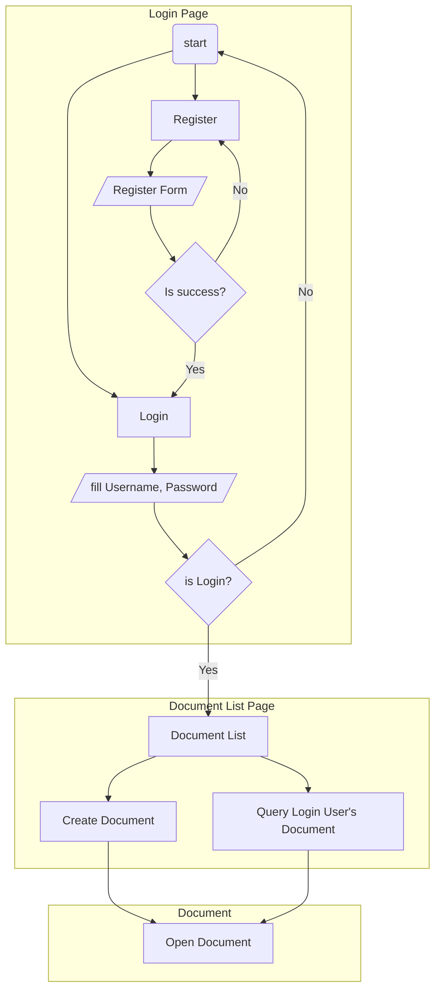

# docs-demo-express
UI: [Github](https://github.com/becory/docs-demo-ui/)
API: [Github](https://github.com/becory/docs-demo-express/)

## Technical

### UI
1. React Hook
2. React Router Dom
3. Tailwinds (SCSS)
4. QuillJS (Editor)

### API
1. Express
2. Sequelize
3. PostgresSQL
4. Socket.io

User story
---

```gherkin=
Feature: Users can collaborate each other.

  Scenario: User create or open document.
    When the user create or open document.
    Then Those user who opened the document will track and sync the cursor, selection and document change.

  Scenario: The creator can set the document who can read or edit it.
    Given The creator can set a authorization list for a document.
    When The User on the authorization list.
    Then He/She can be edit or read only the document.
```

User Flow
---


## Data Schema

